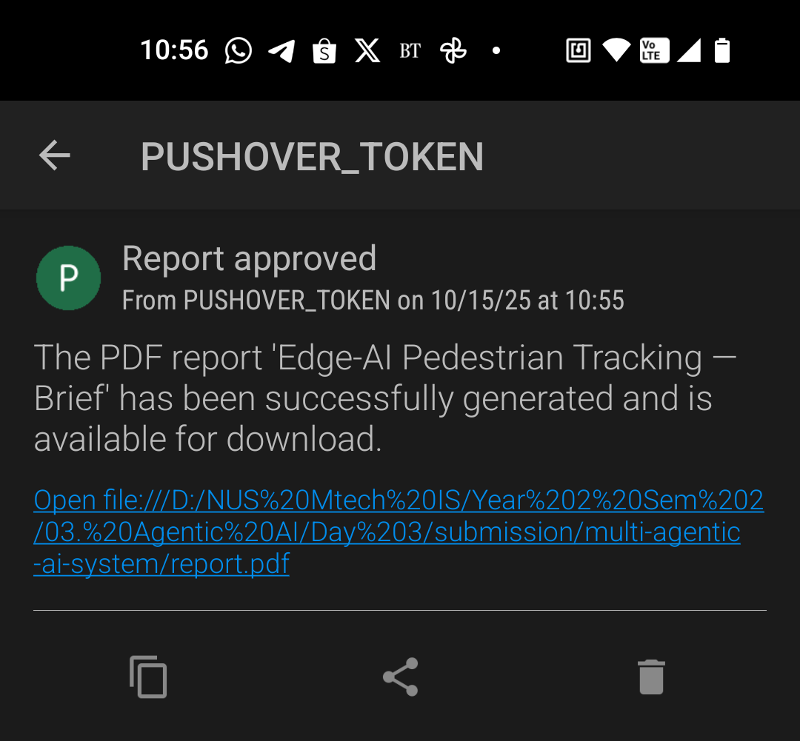

** Report Generator **
## Graph workflow


## App UI


<div style="display:flex; gap:10px;">
  
  
</div>


---

## 🧩 Tech Stack

- **Python 3.12+**
- **LangGraph** for stateful orchestration
- **LLM** via your chosen provider (e.g., OpenAI)  
- **Tavily** (`TAVILY_API_KEY`) for web search
- **Gradio** for UI
- **reportlab** for PDF
- **LangSmith** (optional) for tracing: `LANGSMITH_TRACING=true`
- **Pushover** for notifications

---

## 🔧 Setup
### 1) Install dependencies
```bash
source .venv/bin/activate   # Windows: .venv\Scripts\activate
uv add -r requirements.txt
```

### 2) Run app with cli
```bash
uv run app.py
```

### 3) Run app with UI
~~~bash
uv run app_ui.py
~~~

